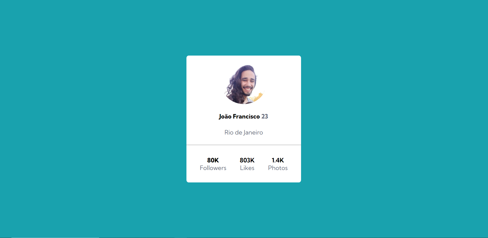

# Projeto Cartão de Perfil

## Descrição

✨O projeto acima é referente à aula de execícios sobre a propriedade Flex e Css Avançado do Curso DevQuest.

📍Neste projeto, criei um cartão de perfil com a minha foto e um número fictício de dados. Este cartão encontra-se centralizado na tela de exibição do dispositivo utilizado pelo usuário que a acessa.

⚡ Nesse projeto, não foi necessário o uso de media queries pois a exibição do cartão se adequa de acordo com a tela do dispositivo do usuário.

## 🌟Linguagens Utilizadas

- Html
- Css

## 🌟Página em Funcionamento:

## Modo de Utilizar

O projeto se trata apenas de uma página de visualização, logo não há instruções para utilizá-la.

 

## 🖋 Autor: João Francisco Fortes André